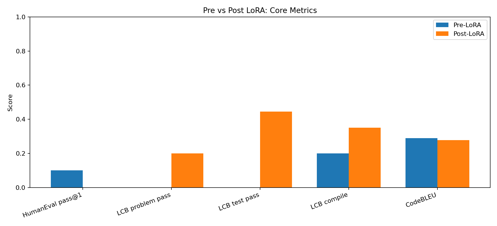
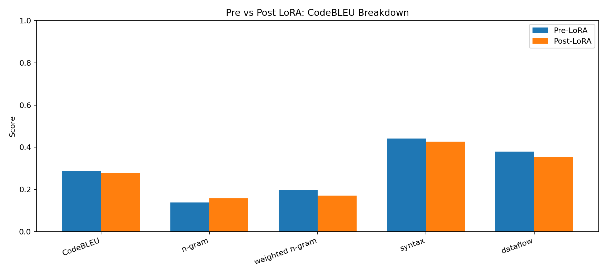
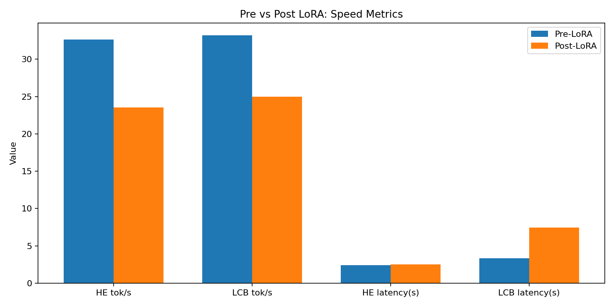

# Qwen3.5-4B 微调前后效果对比（同参数）

## 评测设置

- 微调前运行目录：`eval/results/20260313_182948`
- 微调后运行目录：`eval/results/20260313_193331`
- 微调后 adapter：`lora/sft_outputs/opencode_lora_20260313_184805/adapter`
- 统一参数：
  - `dtype=bf16`
  - `temperature=0.0`
  - `top_p=1.0`
  - `max_new_tokens=256`
  - `lcb_max_new_tokens=768`
  - `humaneval_n=20`
  - `lcb_n=20`
  - `exec_timeout=4`

## 核心指标对比表

| 指标 | 微调前 | 微调后 | 变化（后-前） |
|---|---:|---:|---:|
| HumanEval pass@1 | 0.1000 | 0.0000 | -0.1000 |
| CodeBLEU | 0.2892 | 0.2775 | -0.0117 |
| CodeBLEU ngram | 0.1392 | 0.1577 | +0.0185 |
| CodeBLEU weighted ngram | 0.1975 | 0.1711 | -0.0264 |
| CodeBLEU syntax | 0.4410 | 0.4265 | -0.0145 |
| CodeBLEU dataflow | 0.3790 | 0.3548 | -0.0242 |
| LCB public_problem_pass_rate | 0.0000 | 0.2000 | +0.2000 |
| LCB public_test_pass_rate | 0.0000 | 0.4444 | +0.4444 |
| LCB compile_success_rate | 0.2000 | 0.3500 | +0.1500 |

## 速度指标对比表

### HumanEval 速度

| 指标 | 微调前 | 微调后 | 变化（后-前） |
|---|---:|---:|---:|
| avg_generated_tokens | 78.45 | 59.75 | -18.70 |
| avg_latency_sec | 2.4045 | 2.5359 | +0.1314 |
| overall_tokens_per_sec | 32.6264 | 23.5621 | -9.0643 |

### LiveCodeBench-lite 速度

| 指标 | 微调前 | 微调后 | 变化（后-前） |
|---|---:|---:|---:|
| avg_generated_tokens | 111.45 | 186.40 | +74.95 |
| avg_latency_sec | 3.3567 | 7.4550 | +4.0983 |
| overall_tokens_per_sec | 33.2022 | 25.0032 | -8.1990 |

## 结果解读（直观）

1. 在 HumanEval 子集上，微调后分数下降（pass@1 从 0.10 到 0.00，CodeBLEU 略降）。
2. 在 LiveCodeBench-lite 公开测试上，微调后明显提升（从 0 提升到 problem pass 0.20，test pass 0.4444，compile 0.35）。
3. 速度方面，微调后整体吞吐下降，尤其在 LCB 上生成更长、耗时更高。
4. 这说明本次 LoRA（OpenCodeInstruct，短步数）让模型更偏向竞赛题端到端输出能力，但对 HumanEval 函数补全型任务未带来收益。

本次使用的统一参数

dtype=bf16
temperature=0.0
top_p=1.0
max_new_tokens=256
lcb_max_new_tokens=768
humaneval_n=20
lcb_n=20
exec_timeout=4
直观对比（核心指标）

指标	微调前	微调后	变化
HumanEval pass@1	0.1000	0.0000	-0.1000
CodeBLEU	0.2892	0.2775	-0.0117
LCB public_problem_pass_rate	0.0000	0.2000	+0.2000
LCB public_test_pass_rate	0.0000	0.4444	+0.4444
LCB compile_success_rate	0.2000	0.3500	+0.1500
结论

这次 LoRA 微调后，在 HumanEval 子集上下降。
在 LiveCodeBench-lite 子集上明显提升。

## 结论

这次微调属于“任务分布偏移”现象：

- 对 LCB-lite 风格任务有正向效果。
- 对 HumanEval 风格任务有负向或未泛化效果。

后续建议：

1. 增加训练步数与样本规模（如 5k+ 样本、200+ steps）再复测。
2. 采用混合数据（OpenCodeInstruct + HumanEval/MBPP 风格）降低单一分布偏置。
3. 分别固定两类验证集做早停，避免只对单类任务过拟合。

## 图表展示（核心数据可视化）

### 1) 核心指标对比

### 2) CodeBLEU 分项对比

### 3) 速度指标对比

图表摘要文件：`eval/results/figures/pre_post_figures_summary.json`
